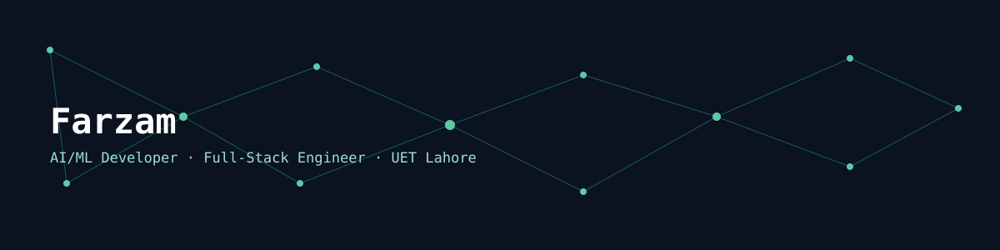

<p align="center">
  
</p>

<p align="center">
  <a href="[LINKEDIN_URL]"></a>
  <a href="mailto:[EMAIL]"></a>
  <a href="https://github.com/[GITHUB_USERNAME]"></a>
</p>

<h3 align="center">Turning data into decisions, and ideas into shipped products.</h3>

---

### Signal

```
node: identity        → BS Computer Science, UET Lahore (Class of 2027, GPA 3.51/4.0)
node: specialization  → AI/ML & Python development, with full-stack as a differentiator
node: leadership      → Operations Lead @ UET Tribune · Co-Head @ UET Newline
node: certifications  → Huawei HCIA-AI · Google AI Essentials
node: status          → Open to AI/ML & Full-Stack internships, freelance projects
```

---

### Network map — what I'm building

| Node | Connects to | Description |
|---|---|---|
| **Capsule Hub** | Chrome APIs → LLM APIs | Cross-platform AI conversation capture & transfer extension. React + Tailwind popup, vanilla JS content scripts/service worker, LLM summarization pipeline |
| **SeenMail** | Gmail → Flask backend | WhatsApp-style read receipts inside Gmail using a tracking-pixel approach |
| **AI Customer Support Chatbot** | LangChain → ChromaDB → Gemini API | RAG-based chatbot with retrieval-augmented responses |
| **Automated Lead Gen & Enrichment** | Python → Flask → LLM APIs | Enrichment pipeline for lead data |
| **Pneumonia Detection System** | CNN → medical imaging data | Deep learning classifier for chest X-rays |
| **Cartoonify** | OpenCV → Streamlit | Computer vision app that stylizes images |

---

### Weighted edges — tech stack

```
Python        ████████████████████  primary
JavaScript    ████████████████░░░░  strong
React         ██████████████░░░░░░  strong
Flask         ██████████████░░░░░░  strong
LangChain     ████████████░░░░░░░░  applied
PostgreSQL    ██████████░░░░░░░░░░  applied
Tailwind CSS  ████████████████░░░░  strong
Gemini/OpenAI ██████████████░░░░░░  applied
```

---

### Traversal path — how I got here

```
[UET Lahore, BS CS] 
      │
      ├── coursework in AI/ML, deep learning, databases
      │
      ├── projects: Capsule Hub, RAG chatbot, fraud analytics (FYP)
      │
      ├── certifications: Huawei HCIA-AI, Google AI Essentials
      │
      └── freelance & outreach: cold-pitched full websites,
          AI automation concepts, portfolio-driven client acquisition
```

---

### Connect

```
> ping [LINKEDIN_URL]
> mail [EMAIL]
> clone https://github.com/[GITHUB_USERNAME]
```

<p align="center">
  
</p>
